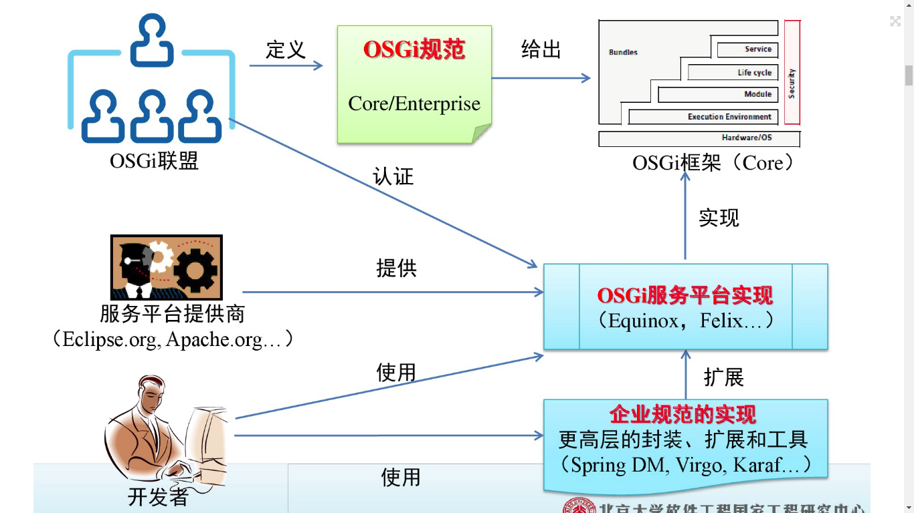
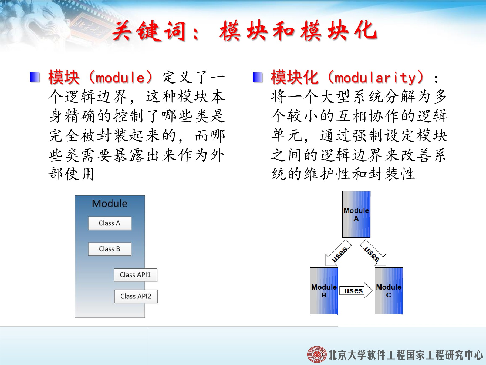
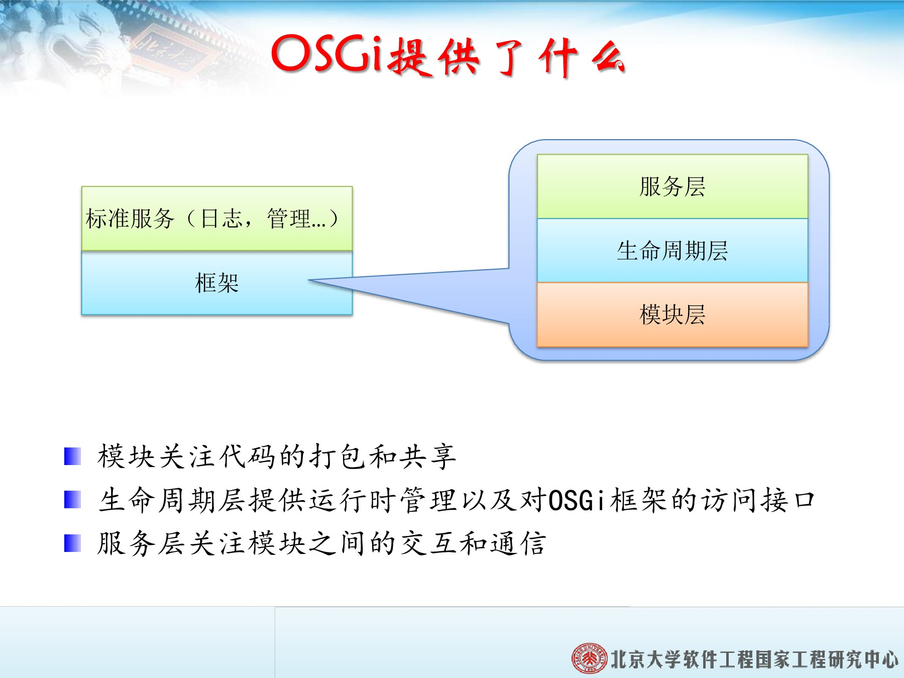
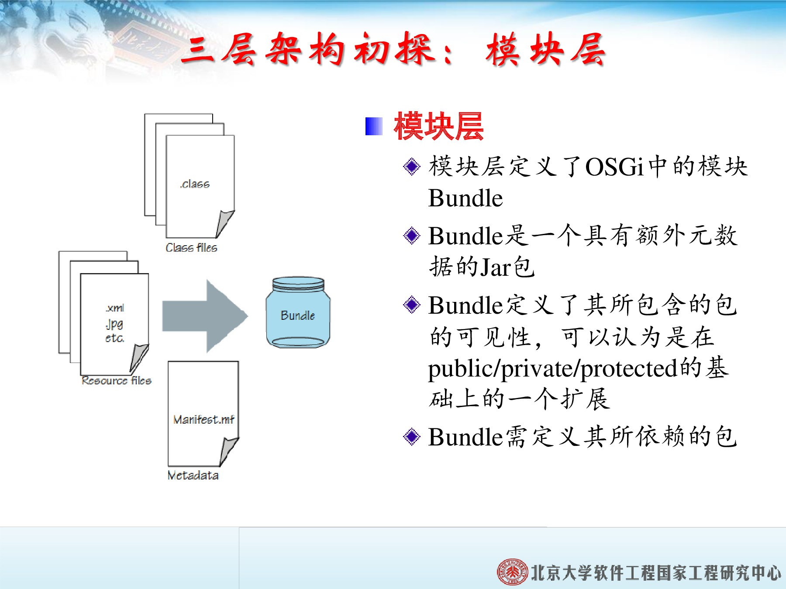
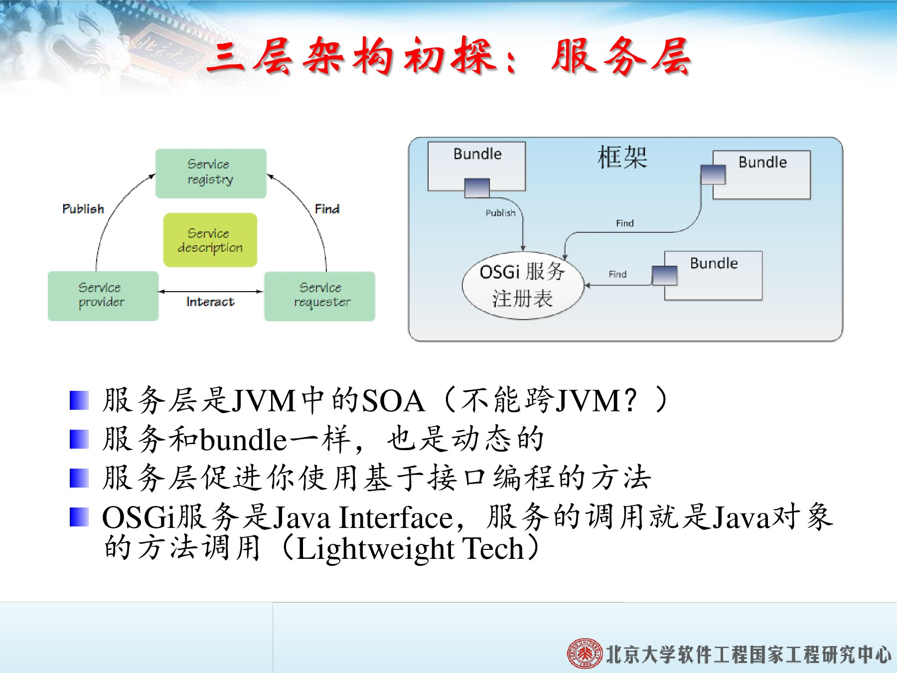

# OSGI

*OSGI*技术是指Java动态模块化系统的一系列**规范**。

*OSGI*联盟的职责：
* 定义标准
* 提供标准的参考实现
* 提供OSGI的测试套件及OSGI认证

## 概念

1. **模块 module**定义了一个逻辑边界，这种模块本身精确地控制了哪些类是完全被封装起来的，而哪些类需要暴露出来为外部使用。
    
2. **模块化 modularity** 将一个大型系统分解为多个较小的互相协作的逻辑单元，通过强制设定模块之间的**逻辑边界**来改善系统的维护性和封装性。
    
    
## OSGI 提供的能力

* 模块层关注代码的打包和共享。
* 生命周期曾提供运行时管理以及对OSGI框架的访问接口。
* 服务层关注模块之间的交互和通信。

### 模块层

* 模块层定义了OSGI中的模块*bundle*
* *bundle*是一个具有额外元数据的JAR包
* *bundle*定义了其所包含的包的可见性，可以认为是在`public, protect, private`基础上的扩展
* *bundle*定义了所依赖的包

### 生命周期曾

生命周期层有两个目的：
1. 模块生命周期的操作(*install, update, start, stop ...*)使得**外部**可以动态的管理和演化系统。
2. 生命周期曾定义了运行时上下文的接口，因此`bundle`本身可以和OSGI框架进行交互，从而实现**内部**自我管理。

### 服务层

* 服务和*bundle*一样也是动态的。
* 服务层促进使用面向接口编程的方法。
* OSGI服务是*Java Interface*，服务的调用就是Java对象方法的调用。   

## OSGI 优势

1. OSGI提供了更加严格的模块化特性，更严格的一致性检查。
2. 基于接口编程，完全隐藏实现，促进在架构上的思考。
3. 动态性，对扩展开放，即使是在运行时。