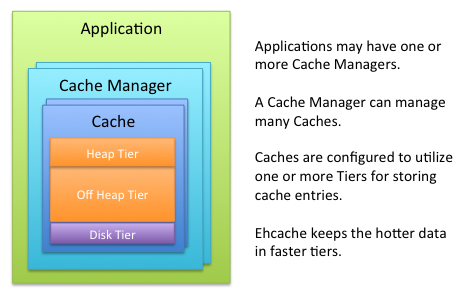

# 缓存一般术语

1. `Cache`，用于存放东西，并在后续能被快速索引到。一个缓存就是一个临时数据的集合，要么是已存在数据的副本，要么是一个计算的结果。**缓存中的数据能被快速获取。**
2. `Cache Entry`，一个缓存实体为缓存中的一个键值对。  
3. `Cache Hit`，当缓存中存在指定`key`的数据时，成为缓存命中。  
4. `Cache Miss`，当缓存中指定`key`的数据不存在时，称为缓存丢失。
5. `System-of-Record(SOR)`，为可靠数据的源。SOR通常是传统的数据库。
6. `Eviction`，从缓存中移除实体，并存入新的缓存实体。典型情况为，存入缓存中的数据超出了指定的容量。
7. `Expiration`，当超过一定时间时将缓存实体从缓存中移除。典型情况为，作为一种策略防止陈旧的数据还留在缓存中。
8. `Hot Data`，才被应用使用过的数据很有可能会很快再次被使用，这样的数据被认为是**热数据**。一个缓存应该尝试使得最热的数据能够最快被取到，并将最不热的数据`eviction`。

# 缓存概念

1. `Data Freshmess`，表示怎样将缓存中的数据与SOR中的数据进行比较更新。一个陈旧的缓存数据被认为是与SOR不同不。因为数据库（或其他SOR）一般默认实现不会在数据被更新或改变
时通知外部组件，因此外部组件中加载的数据没法直接保证是没有陈据过期的。  
2. `Cache Entry Expriation`，缓存实体过期。Ehache能够降低出现陈旧数据的可能性，因为一旦数据过期就会被从缓存中移除掉。有两种过期设置机制：
    1. TTL(time-to-live)，当从存入缓存开始存在的时间超过指定的时间是，缓存实体过期，被从缓存中移除。
    2. TTI(time-to-idle)，当从缓存中上次获取该缓存实体到当前的时间超过指定的时间时，缓存实体过期，被从缓存中移除。
3. `Storage Tiers`，可以配置使用不同的方式存储数据。当一个缓存被配置使用不同的方式存储时，，这些存储方式被分配并被当作`tiers`管理。它们被按分层的方式管理，
    最低下的曾最称为`authority`层，其他部分则被称为`caching`层(也叫 near cache)。`caching 层`能以多种方式混合存储数据。最热的数据被存储在`cachiing tier`中，与
    权威层相比它的数据不够丰富但是获取速度快。所有的数据都存储在权威层中，它的获取数据较慢但是数据丰富。Ehcache支持如下存储方式：
    1. `On-Heap`存储，利用`on-heap ROM`内存存储缓存实体。该层利用与java应用一样的堆内存，所有的都会被JVM的垃圾回收机制扫描。JVM使用的堆空间越大，则回收机制
        对应用性能的影响越大。这种存储方式的速度非常的快，但是也很大的限制了存储资源。
    2. `Off-Heap`存储，仅限于可用的RAM。它不会影响JVM的垃圾回收。它相较上一种方式速度较慢。
    3. `Disk`存储，利用硬盘空间去存储缓存实体。这种存储方式的资源非常丰富但是速度比起基于RAM的方式较慢。当整个应用都使用硬盘存储时，建议使用快速和专用的硬盘来优化吞吐量。
    4. `Clustered`存储，缓存存储在远程服务器中。远程服务器可以可选的提供备份服务器用于提高高可用性。由于集群带来的**性能惩罚**，因为网络延迟等因素，以及保证客户端-服务端的**一致性**，
        因此这种方式与`off-heap`相比更慢。
        

> 应用可以有一个或多个Cache Manager。一个Cache Manager能够管理多个Cache。Cache能够利用多种存储方式去存储缓存实体。
> Ehcahe将最热的数据保存在最快的层中。

## 拓扑类型

1. **Standalone 独立的**，数据集被应用节点所拥有，其他的应用节点与之独立并不相互交流。当使用独立拓扑结构，且有多个应用节点运行相同的应用，则它们的缓存是完全独立的。
2. **Distributed/Clustered**，数据被存储在远程服务器中，并有一个子集的热数据存储在每一个的应用节点中。它提供了性能、可用性和可伸缩性的最佳组合。
    在集群或可伸缩应用中建议使用这种拓扑方式。

