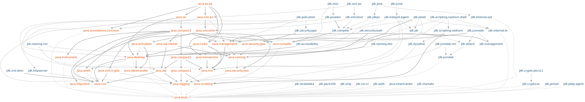

# Jigsaw

*[Java Jigsaw](http://openjdk.java.net/projects/jigsaw/)*项目的目的：
* 使Java SE平台和JDK可以更容易的应付小的计算设备。
* 提高Java SE平台的安全性和可维护性。
* 提高应用的性能。
* 使开发者可以更容易的构造和维护大的应用程序，包括Java Se 和 Java EE平台。

为了实现上述目标，Java为Java SE平台设计并实现了一个**标准模块化系统 Standard Module System**，并将该系统应用到了Java平台和JDK。

模块系统设计原则：
1. 标准模块，名字必须以`java.`开头。
2. 其他模块都仅仅是JDK的部分，名字必须以`jdk.`开头。
3. 如果一个模块`export`一个包且包含一个类型，且该类型包含`public`或`protected`成员变量的类型为其他模块中的类型，则**第一个模块必须赋予第二个模块隐含可读性**，
通过`require public`。这确保了方法调用链**method-invocation chaining**以一种明显的方式工作。
4. 一个标准模块可能包含标准或非标准的API包。如果一个标准模块导出一个标准API包，那么这个导出**可能**是合格的。如果一个标准模块导出一个非标准API包，那么这个导出**必须**
是合格的。
5. 一个标准模块可能依赖于一个或多个非标准模块。它一定不能赋予任何非标准模块隐含可读性。如果它是一个Java SE模块，那么它一定不能赋予任何非Java SE模块隐含可读性。
6. 一个非标准模块一定不能导出标准API包。一个非标准模块可能赋予标准模块隐含可读性。

**Java 模块图**

* 标准SE模块用橙色标注，非SE模块用蓝色标注。
* 如果一个模块依赖其他模块，并且它赋予其他模块隐含可读性，则连线是实体的。否则，就是虚线。
* 在最底部的是`java.base`模块，它包含了必须的类，如`java.lang.Object, java.lang.String`等。该基础模块不依赖其他任何模块，且其他任何模块都依赖该模块。
* 在最顶部的是`java.se.ee`模块，它聚集了组成Java SE平台的所有模块，包含与Java EE平台规范重叠的模块。这是**聚合模块**的一个例子，它收集并重新导出*re-export*其他模块
的内容，且不添加任何新的东西。
* `java.se`聚合模块具体了SE平台与EE平台没有重叠的那部分模块。
* `java.compact1, java.compact2, java.compact3`