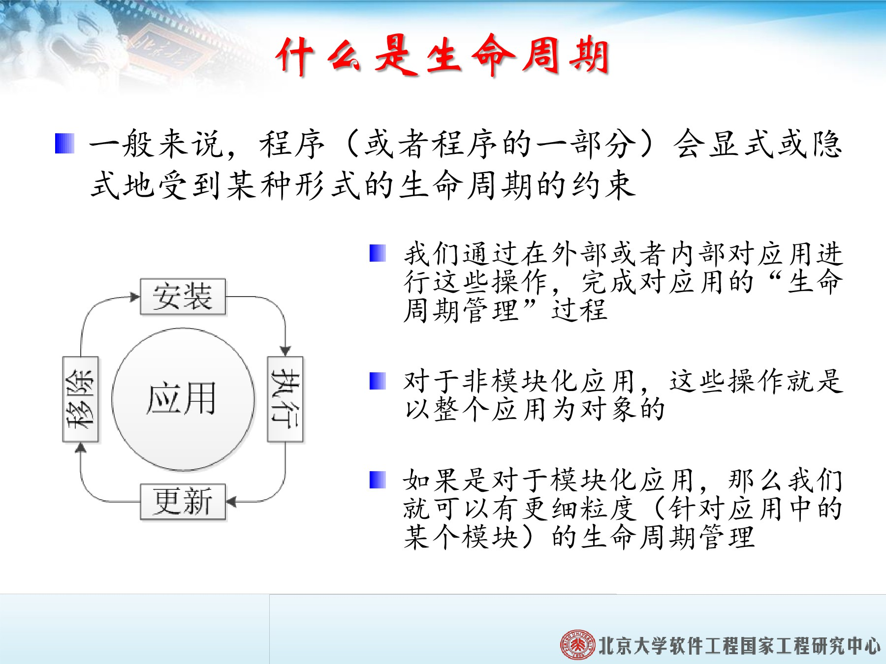
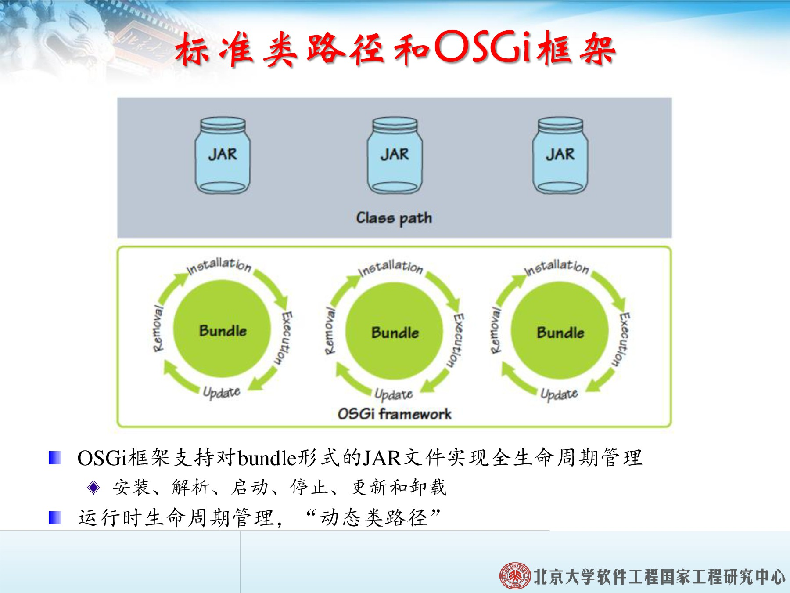
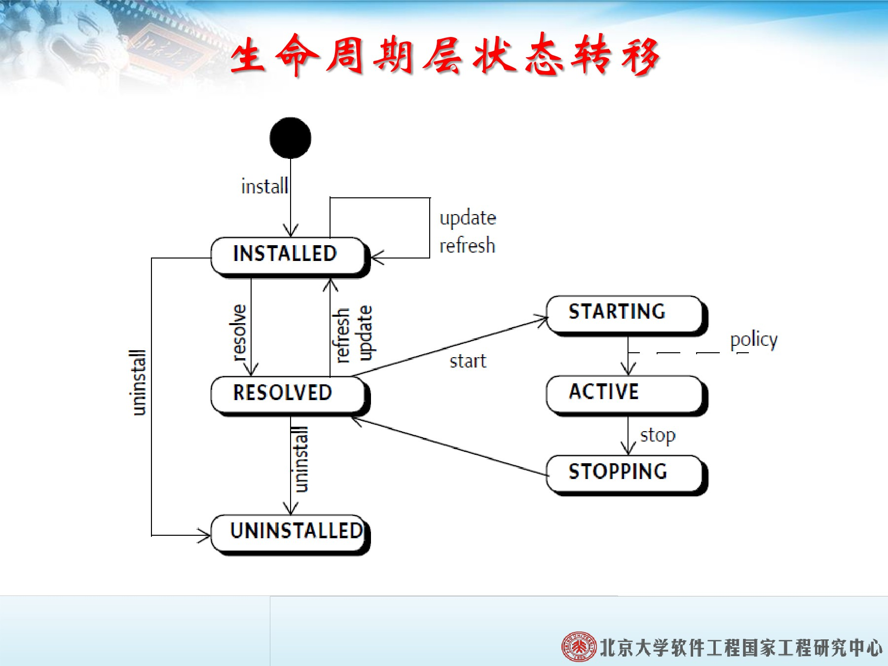

# OSGI 生命周期层

一般来说，程序(或程序的一部分)会显示或隐式地受到某种形式的声明周期的约束。
* 安装
* 执行
* 更新
* 移除

* 通过在外部或者内部对应用进行这些操作，完成对应用”生命周期管理“的过程。
* 对于非模块化应用，这些操作就是以整个应用为对象的。
* 如果是对于模块化应用，就可以有更细粒度(针对应用中的某个模块)的声明周期管理。

## 生命周期层的作用

1. 在应用程序外部，生命周期层精确定义了对*bundle*生命周期的相关操作。
2. 对生命周期的操作，允许动态地改变运行与框架中*bundle*组成，并以此来管理和演化应用程序。
3. 在应用程序内部，生命周期层定义了*bundle*访问其执行上下文的方式，为*bundle*提供了一种与OSGI框架交互的途径以及一些执行时的便利条件。

OSGI框架支持对*bundle*形式的JAR文件实现生命周期管理**安装、解析、启动、停止、更新和卸载**

## 接入生命周期层

* 开始使用生命周期层的基础设施：*BundleActivator*。
* 调用`start()`方法的激活器实例与调用`stop()`的实例是同一个。
* 当`stop()`方法被调用后，激活器实例就被丢弃并不再使用。
* 如果一个*bundle*被停止后，又重新启动，那么将创建一个新的激活器实例，同时它的`start()`方法和`stop()`方法也将适时被触发。

## 使用生命周期层

1. `BundleContext`
    * 与部署与生命周期管理相关的接口
    * 与*bundle*间服务交互相关接口
2. 在`bundle`属于`active`状态时，`BundeleContext`才有意义，即`start`方法被调用和`stop`方法被调用的两个时间点之间。
3. 为了`bundle`的安全和资源分配，不应该被随意在`bundle`之间传递。

**Bundle的逻辑表示**
`Bundle`定义了一系列的API，用于管理已安装的*bundle*的生命周期。
* 获取*bundle*信息
* 修改*bundle*状态

**启动级别**
* 启动级别的数值越高，代表的启动阈值就越高，即启动的顺序越靠后。
* 只有`System Bundle`(Bundle Id 为0)的启动级别可以为 0，其他*bundle*的启动级别都大于 0，最大值为`Integer.MAX_VALUE`。

**系统Bundle**
* 启动过程：`Bundle`的`start()`方法为空操作，因为OSGI框架一启动，系统*bundle*就已经启动。
* 停止过程：`Bundle`的`stop()`方法会立即返回并在另一条线程中关闭OSGI框架。
* 更新过程：`Bundle`的`update()`方法会立即返回并在另一个线程中重启OSGI框架。
* 卸载过程：系统`Bundle`无法卸载，如果执行了*bundle*的`uninstall()`方法，那么框架会抛出一个`BundleException`异常。

**Bundle刷新流程：**
1. 从某一`bundle`开始计算受影响的`bundle`的有向图。
2. 处于`ACTIVE`状态的`bundle`被停止并切换至`RESOLVED`状态。
3. 处于`RESOLVED`状态的`bundle`，切换至`INSTALLED`状态，这些`bundle`的依赖关系不再被解析。
4. 处于`UNINSTALLED`状态的`bundle`会被从图中移除，同时也会被彻底地从框架中移除(由垃圾回收器回收)。
5. 其他`bundle`,如果框架重启之前处于`ACTIVE`状态，重启前框架会对这些`bundle`以及其所依赖的`bundle`进行解析。
6. 当所有工作都完成后，框架会触发一个`FrameworkEvent.PACKAGES_REFRESHED`事件。

## 小节

1. `BundleActivator`是`bundle`的入口，与标准Java应用中的静态`main()`方法类似。
2. `BundleContext`为应用提供了运行时操作OSGI框架的方法。
3. `Bundle`代表了一个已安装到框架中的`bundle`,允许对其进行状态操作。

